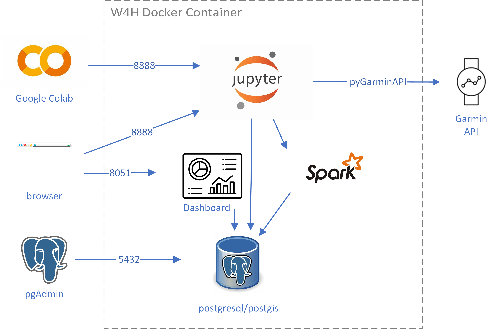

# W4H Dashboard 
NOTE: This is a fork of the https://github.com/USC-InfoLab/w4h-integrated-toolkit repository.

The Wearables for Health (W4H) Integrated Toolkit Repository serves as a centralized hub for managing, analyzing, and visualizing wearable data in a seamless and efficient manner. This repository hosts a suite of open-source tools and frameworks meticulously engineered to facilitate end-to-end processing of wearable data, ranging from data ingestion from various sources to real-time and offline analytics, all the way to insightful visualization. 

At the core of the toolkit lies the novel Geospatial Multivariate Time Series (GeoMTS) abstraction, which enables streamlined management and analysis of wearable data. The repository encompasses key components such as StreamSim for simulating real-time data streaming, W4H ImportHub for integrating offline datasets, pyGarminAPI and pyFitbitAPI for efficient interaction with popular wearable device APIs, and an Integrated Analytics Dashboard for effective data extraction, presentation, and analysis. 

## Toolkit Architecture

The W4H Integrated Toolkit has been designed to run in a single Docker container.

## Toolkit Components
This toolkit contains the following components, each tailored to address specific needs in the wearable data lifecycle:

- **Integrated Analytics Dashboard**: Core component for GeoMTS data extraction, presentation, and analysis, supporting both real-time and offline analytics on GeoMTS data. (Source code included in this repo)

    - **[StreamSim](https://github.com/USC-InfoLab/StreamSim)**: A real-time data streaming simulator tool for tabular data, aiding in testing real-time applications.

    - **[W4H ImportHub](https://github.com/USC-InfoLab/W4H-ImportHub)**: Your gateway for seamlessly integrating stored datasets like CSV files into the W4H platform.

- **[Jupyter Lab](https://jupyter.org/)**: Jupyter Lab is and interactive development environment for notebooks, code, and data.

- **[pyGarminAPI](https://github.com/USC-InfoLab/pyGarminAPI)**: A Python library to interact with the Garmin API, facilitating the retrieval of activity and health data from Garmin devices.

- **[PySpark](https://spark.apache.org/docs/latest/api/python/index.html)**: PySpark is the Python API for Apache Spark. It enables you to perform real-time, large-scale data processing using Python. It also provides a PySpark shell for interactively analyzing your data. 

- **[Postgresql Database](https://www.postgresql.org/)**:

    - **[PostGIS Extention](https://postgis.net)**: PostGIS extends the capabilities of the PostgreSQL relational database by adding support for storing, indexing, and querying geospatial data.

    - **[Approximate Aggregate Queries on GeoMTS](https://github.com/USC-InfoLab/fft_approximate)**: A PostgreSQL extension `fft_approximate` for quickly answering aggregate range queries on time series data using an approximate approach.

## Getting Started with Docker

To get started with using the W4H Integrated Toolkit, please see [Docker Getting Started](/docs/docker_getting_started.md)
